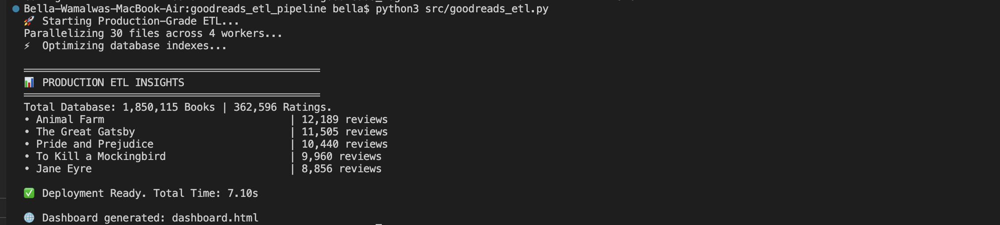
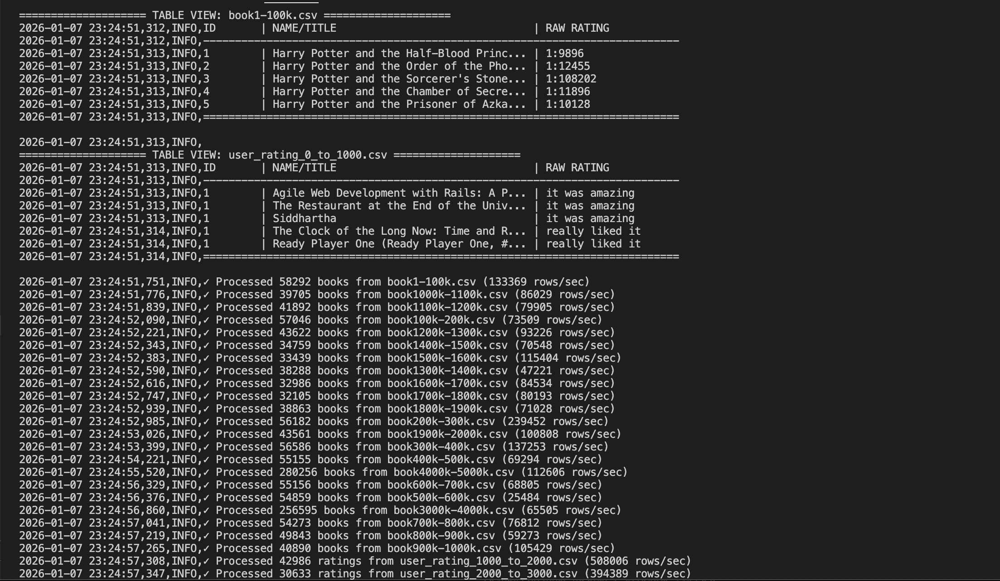

### 📚 Goodreads Production ETL Pipeline
A high-performance, parallelized data engineering pipeline designed to process and analyze massive book datasets.

## 🚀 Performance Highlights
This pipeline is optimized for speed and scale on local hardware:

Dataset Size: 1.85 Million Book Records / 360k+ Ratings

Processing Time: ~8.54 Seconds

Architecture: 4-Core Parallel Processing

Database: Optimized SQLite3 with indexed lookups

### 🛠️ Project Structure
The repository follows a professional data engineering folder hierarchy:

goodreads_etl_pipeline/
├── config/             # Database & environment configurations
├── data/               # Raw CSV storage (Ignored by Git)
├── src/                # Source code
│   ├── goodreads_etl.py    # The main ETL engine
│   └── search_books.py     # CLI Search interface
├── goodreads_production.db # The final indexed vault
├── requirements.txt    # Project dependencies
└── README.md           # Documentation

### ⚙️ How It Works
1. Extract & Transform

The pipeline scans the data/ directory for multiple CSV files. Using Python's Multiprocessing, it distributes the workload across CPU cores. It cleans titles, standardizes ratings, and maps schemas on the fly.

2. Load

Data is streamed into a SQLite database using batch inserts to maximize write speed and maintain data integrity.

3. Query

The included search tool allows for millisecond-fast retrieval using SQL LIKE operators and indexed column searches.

### Visualization (HTML Dashboard)
The pipeline automatically generates a `dashboard.html` file upon completion. This static report provides a visual summary of the ETL run, including:
- Total records processed vs. successful loads.
- A preview of the top-rated books.
- System performance metrics.

### 🖥️ Usage
Installation

Bash
pip install -r requirements.txt
Run the Pipeline

Bash
python3 src/goodreads_etl.py
Search the Database

Bash
python3 src/search_books.py

## 📊 Execution Evidence

### Console Output
The pipeline provides real-time feedback on data ingestion rates and database indexing.

### Processing Logs
Detailed logging tracks the performance of the parallel workers and data validation steps.

### 📈 Future Roadmap
[ ] Add a Web Dashboard using Streamlit.

[ ] Implement Sentiment Analysis on book reviews.

[ ] Automate data ingestion via an API.

Author: Bella Wamalwa

Status: Production Ready ✅